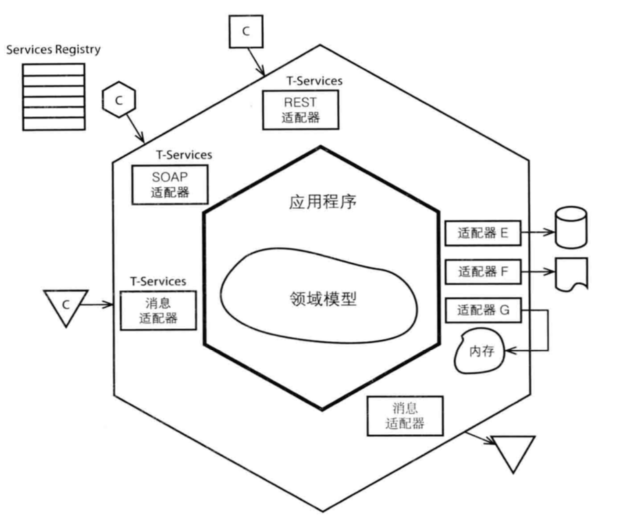
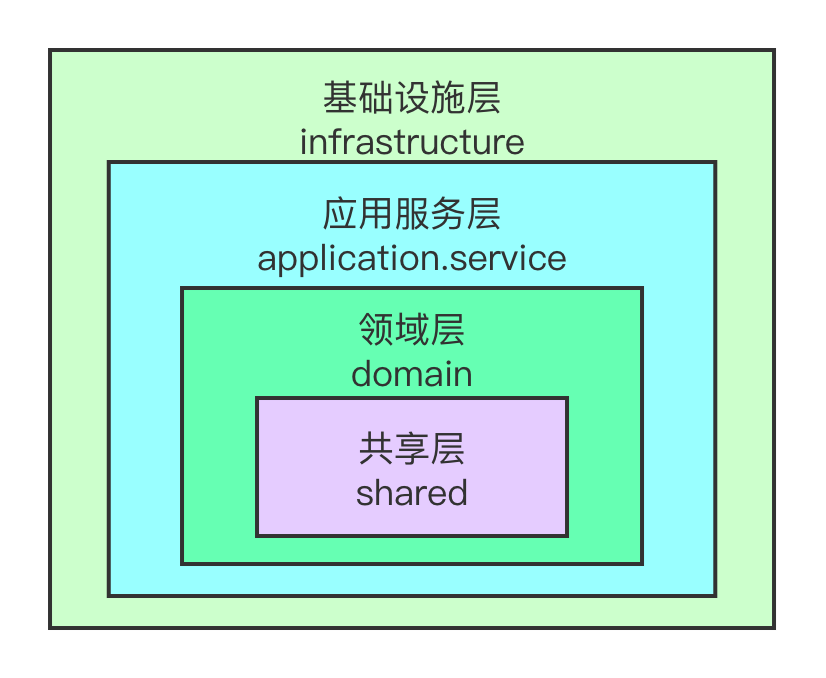

## 基本概念

1. 实体：具有生命周期和唯一标识的对象。
2. 值对象：用于对事务描述而没有唯一标识的对象。
3. 充血模型：业务逻辑存在于领域模型中。
4. 聚合（Aggregate）：一些对象的集合，这些对象之间存在高聚合的关系。
5. 聚合根（Aggregate Root）：在聚合中最主要的对象。
6. 领域服务（Domain Service）：不能归属到任意一个领域模型中的业务逻辑，通常这个业务逻辑横跨了多个领域模型。
7. 仓储（Repository）：负责将领域模型中的数据持久化到数据库中。
8. 战略设计：与领域专家一起对业务进行领域的划分，理清领域的界限上下文以及领域与领域之间的关系，这里对应软件开发过程中的需求分析阶段。
9. 战术设计：对单个领域进行领域模型的设计。

## 六边形架构与依赖倒置



六边形架构分为三层：基础设施层、应用服务层以及领域层，它们之间遵循的是**依赖倒置原则**，即**高层模块不应该依赖于低层模块，两者应该依赖于抽象，抽象不应该依赖于细节，细节应该依赖于抽象**。怎么理解这句话呢？没错，就是面向接口编程（接口定义在高层模块中的，而接口的实现定义在低层模块中）。这样达到的效果是高层模块只会依赖自己内部的接口，而不会去依赖低层模块；低层模块会创建实现类去依赖高层模块中的接口。这就是依赖倒置，它实现了模块间的**高内聚与低耦合**。

在六边形架构中，基础设施层就是低层模块，而应用服务层与领域层就是高层模块，基础设施层中代码结构的改变不会影响到领域模型内部的逻辑的变化，这就是依赖倒置的好处。判断一个 ddd 架构是否符合六边形架构的一个很简单的方式如下：

1. **判断是否将所有与领域无关的外部操作统一看作是基础设施层。**基础设施层所做的一切操作都与领域无关，但它是用领域对象或领域事件与内层进行数据交互的，因此在基础设施层存在各种适配器，这些适配器负责把领域对象转为自己需要处理的数据（出口）或者将接收到的数据转为领域对象（入口）。
2. **判断层与层之间的依赖关系是否符合依赖倒置原则。**一个简单的判断方式就是看把基础设施层的代码删掉后，内层的代码会不会报错（忽略没有接口实现类的注入错误），如果没有报错，则符合依赖倒置原则。

关于分层架构与六边形架构的比较，可以见[这篇文章](https://insights.thoughtworks.cn/from-sandwich-to-hexagon/)。

## 落地 DDD

在采用 DDD 这套思路去落地代码的时候，因为对业务需求的理解不同，写出来的代码可能会有差异，比如有的人将业务逻辑写在了领域对象中，而有的人却把同一套逻辑写在了领域服务中。不同的写法孰对孰错没有一个明确的评判标准，这需要通过内部讨论来分析或者制定一套内部的标准。

虽说落地 DDD 没有一个非常明确的标准，但还是有一些原则需要遵循的：

1. **应用服务层不能出现业务逻辑，它只起到封装的作用，不负责业务逻辑。**
2. **业务逻辑由领域对象或者领域服务负责。**落地 ddd 代码的时候需要转变一下思维，将领域对象当做是服务的提供方，而不是数据容器，多思考一个领域对象能够提供哪些行为，而不是数据，详见[这篇文章](https://insights.thoughtworks.cn/path-to-ddd/)。
3. **外层可以拥有内层的类或方法，而内层不应该拥有外层的类或方法。**在六边形架构中，在基础设施层中可以拥有领域对象，但是在内层不能拥有基础设施层中的任何类，所有内层与基础设施层的交互其实都是通过调用定义在内层的接口来实现的。
4. **查询没有领域的概念，应用服务层的查询方法中不会去拥有领域层的类或方法。**

## 本项目的 DDD 分包

本项目的 ddd 分包主要参考了[这篇文章](https://mp.weixin.qq.com/s/R-jBnPhWJHs7J-4CETV88A)，采用的也是六边形架构，由外到内的层级关系如下：



整体目录结构如下：

```latex
├── application.service
│       ├── command
│       │   └── cmd
│       └── query
│           ├── assembler
│           └── dto
├── domain
│   ├── agg
│   ├── entity
│   ├── event
│   ├── repository
│   ├── service
│   └── valueobject
├── infrastructure
│   ├── client.impl
│   ├── db
│   │   ├── adapter
│   │   ├── dataobject
│   │   ├── mapper
│   │   └── repository.impl
│   ├── inbound
│   │   ├── job.controller
│   │   ├── rpc.controller
│   │   └── web.controller
│   └── process.impl
└── shared
    ├── client
    ├── constants
    ├── process
    └── utils
```

整体结构分为 4 块，分别为基础设施层/应用服务层/领域层/ shared 层，有几点需要说明：

1. 整体遵循六边形架构的原则，将 controller 的接口也纳入基础设施层中，不单独划出来管理。

2. 基础设施层中有接口的实现类，它们依赖的接口定义在 domain 层或者 shared 层。如上面的仓储接口定义 repository 和它的实现类 repository.impl，防腐层接口定义 client 和它的实现类 client.impl 等。

   > process 和 process.impl 是流程相关的接口和实现类的位置，我这里将 Camunda 看作是流程引擎的一种具体的实现，所以它是被放在基础设施层的。

3. shared 层用于存放会被 query 和 command 操作共用的接口和数据类，比如一些 utils，一些接口定义都可以放在这。

4. 在实际开发中，基础设施层会采用适配器将内层的领域对象或其他数据对象转化为自己这层的数据对象，但常常这两个对象中的字段几乎一致。因此为了不必要的转化，同时基于外层能够访问内层的数据类或方法这一原则，可以在基础设施层直接将内层的数据类或方法进行透传，或者进行简单的封装，比如在 controller 中直接将 command.cmd 或者 query.dto 作为 controller 的入参或者出参。

   > 在 infrastructure.db 中由于存在 data object，所以这里的适配器转化必不可少，这也是 adapter 路径存在的原因，它需要将 domain 中的领域对象转化为数据数据表对应的 data object。有一种方式是将 data object 直接作为实体放到 domain 中，但这样做的话会导致查询的时候涉及到 domain 层，相当于查询也拥有了领域的概念，不可取，所以还是放在 infrastructure.db 中，然后通过 adapter 做转化。
   >
   > 其实将 data object 放在 infrastructure.db 中也有一个好处，那就是数据表的变动不会影响到领域对象，虽然一般 data object 与 domain object 基本一一对应，但是将 data object 抽出来后会更加的灵活。

5. 同样也是为了不必要的转化，在应用服务层可以直接将 entity 或者 valueobject 中的类作为 command.cmd 中的类上面的某个属性的类型。这没有违背外层调用内层的规则，但可以避免不必要的转化代码。比如在创建聚合的时候不用再去创建值对象，因为在 command.cmd 中接收到的就是一个值对象了。

6. domain 中的目录并没有按照聚合的维度去划分，而是打平之后按不同的类型去管理，其中包括聚合/领域事件/值对象/仓储接口/领域服务/实体这几种类型。